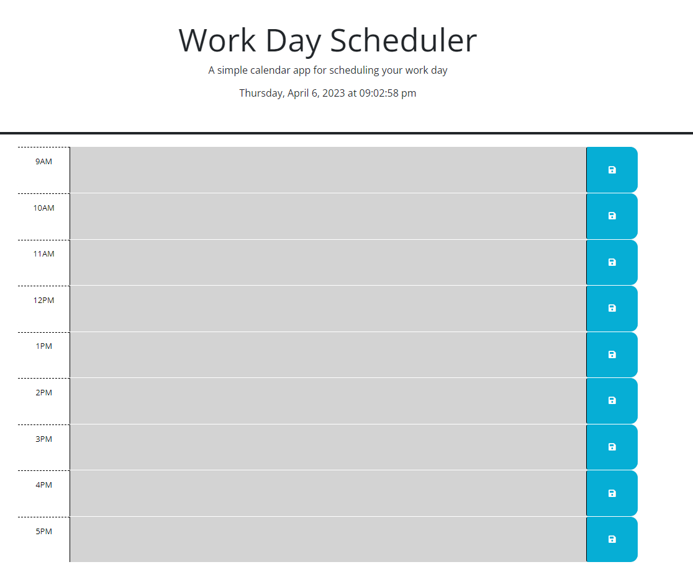
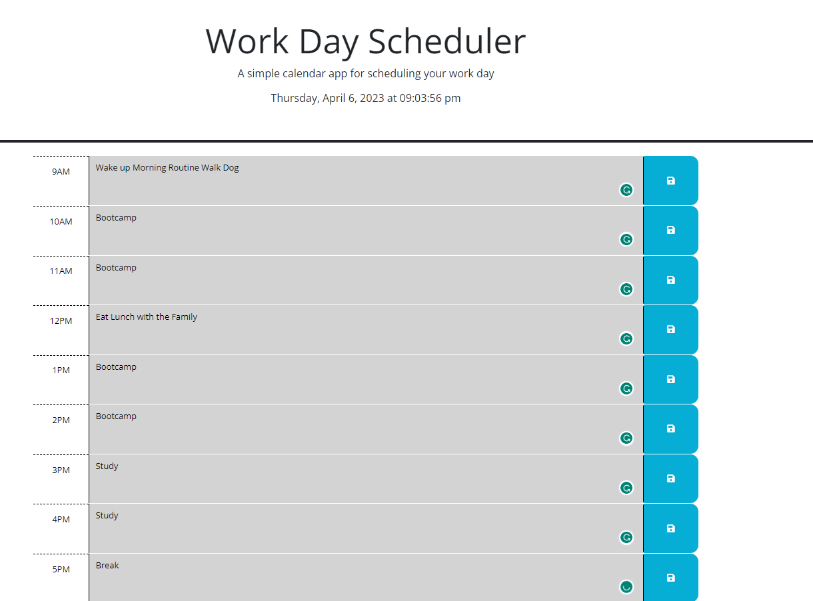
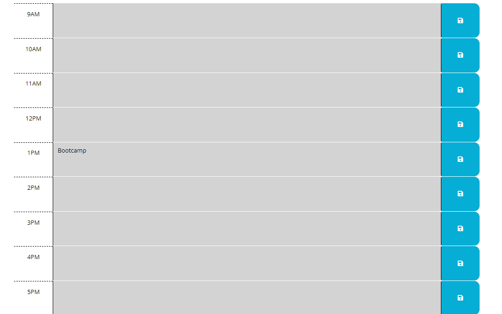

# Day Planner
This is a planner for users to plan out their day with different events that occur.

## Technology Used 

| Technology Used         | Resource URL           | 
| ------------- |:-------------:| 
| HTML    | [https://developer.mozilla.org/en-US/docs/Web/HTML](https://developer.mozilla.org/en-US/docs/Web/HTML) | 
| CSS     | [https://developer.mozilla.org/en-US/docs/Web/CSS](https://developer.mozilla.org/en-US/docs/Web/CSS)      |   
| Git | [https://git-scm.com/](https://git-scm.com/)     |  
| JavaScript | [https://developer.mozilla.org/en-US/docs/Web/javascript](https://developer.mozilla.org/en-US/docs/Web/javascript) |
| JQuery | [https://api.jquery.com/jQuery.browser/](https://api.jquery.com/jQuery.browser/) |

## Description

[Visit the Deployed Site](https://bryannguyen9.github.io/day-planner/)

This project is a website that allows users plan out their day with different events in specific time-blocks.

It contains multiple different elements that allow users to lead a more productive and functional lifestyle with color-coded time periods based on past, present, and future, as well as the ability to save their events for a later date to refer back on.

Again here is a link to my fully deployed website: 
[Site Landing Page](https://bryannguyen9.github.io/day-planner/)

## Table of Contents

* [Homepage](#home-page)
* [Code Example](#code-example)
* [Usage](#usage)
* [Learning Points](#learning-points)
* [Author Info](#author-info)
* [Credits](#credits)
* [License](#license)

## Home Page

The following image shows the web application's appearance and functionality:



## Code Example

Here is a code example of my javascript, specifically my currenTime() and pastPresentFuture() function where the currentTime() function uses the JQuery dayjs() function in order to tell the current date and time. This is used in conjunction for my pastPresentFuture function that allows users to see different color blocks based on their current time and which time blocks are in the past, present, or future.

```javascript
  function currentTime () {
    var today = dayjs();
    $('#currentDay').text(today.format('dddd, MMMM D, YYYY [at] hh:mm:ss a'));
    }

currentTime();
setInterval(currentTime, 1000);

function pastPresentFuture() {
    var presentTime = parseInt(dayjs().format('H')); // use H instead of h for 24-hour format

    for (var i = 9; i < 18; i++) {
        var timeBlock = document.getElementById("hour-"+ i);
        
        if (i < presentTime) {
            timeBlock.classList.add("past");
          } else if (i === presentTime) {
            timeBlock.classList.add("present");
          } else {
            timeBlock.classList.add("future");
          }
    }
}
```

## Usage
 
Here you can see the home page of my day planner:


Here you can see that when you are allowed to enter different events in different time blocks.



Here you can see that when I clicked the save button for only one of the time-blocks. After refreshing the page the time-block input saves with whatever the user inputted into that event into local storage and displays on screen.




## Learning Points 

This is one of my first projects where I implemented different JQuery elements into my project. A lot of different resources were referenced as to how to implement JQuery elements seamlessly into my project making the web app as a whole more functional and user friendly.

I also had to figure out different DOM loading techniques as this is necessary for the user to have a proper save feature when refreshing the page and having the inputs be in local storage.

I enjoyed implementing these techniques into the project and using proper loop logic as that was another major part of this project. Overall I think this project allows users a seamless experience in order to increase productivity as a whole.

These are some links that helped me:

1. [day-js-org](https://day.js.org/docs/en/query/is-a-dayjs)
2. [Mozilla-Developer](https://developer.mozilla.org/en-US/docs/Web/API/Document/DOMContentLoaded_event)
3. [Mozilla-Developer](https://developer.mozilla.org/en-US/docs/Web/API/Window/localStorage)

## About Me

Hi, my name is Bryan Nguyen I am an up and coming full-stack web developer working
on getting into the space with projects that support both my growth, belief, and imagination. I hope to one day work within the realm of AI, web-development, and even site-reliability/the space of cyber-security.

## My links

* [Portfolio](https://bryannguyen9.github.io/Bryan-Nguyen-Portfolio/)
* [LinkedIn](https://linkedin.com/in/bryannguyen9)
* [Github](https://github.com/bryannguyen9)


## Credits

### Special thanks to David Chung: 
 
 * His Github Portfolio: [David-Chung-Github](https://github.com/dchung13/)
 * His Linked-In: [David-Chung-LinkedIn](https://www.linkedin.com/in/david-chung-77141526b/)
 * His Portfolio Site: [David-Chung-Portfolio](https://dchung13.github.io/David-Chung-Portfolio/) 

### Special thanks to these reference websites that taught me different functionalities within my website for me to create a seamless experience for users.

1. [day-js-org](https://day.js.org/docs/en/query/is-a-dayjs)
2. [Mozilla-Developer](https://developer.mozilla.org/en-US/docs/Web/API/Document/DOMContentLoaded_event)
3. [Mozilla-Developer](https://developer.mozilla.org/en-US/docs/Web/API/Window/localStorage)


## License

MIT License

Copyright (c) [2023] [Bryan-Nguyen]

Permission is hereby granted, free of charge, to any person obtaining a copy
of this software and associated documentation files (the "Software"), to deal
in the Software without restriction, including without limitation the rights
to use, copy, modify, merge, publish, distribute, sublicense, and/or sell
copies of the Software, and to permit persons to whom the Software is
furnished to do so, subject to the following conditions:

The above copyright notice and this permission notice shall be included in all
copies or substantial portions of the Software.

THE SOFTWARE IS PROVIDED "AS IS", WITHOUT WARRANTY OF ANY KIND, EXPRESS OR
IMPLIED, INCLUDING BUT NOT LIMITED TO THE WARRANTIES OF MERCHANTABILITY,
FITNESS FOR A PARTICULAR PURPOSE AND NONINFRINGEMENT. IN NO EVENT SHALL THE
AUTHORS OR COPYRIGHT HOLDERS BE LIABLE FOR ANY CLAIM, DAMAGES OR OTHER
LIABILITY, WHETHER IN AN ACTION OF CONTRACT, TORT OR OTHERWISE, ARISING FROM,
OUT OF OR IN CONNECTION WITH THE SOFTWARE OR THE USE OR OTHER DEALINGS IN THE
SOFTWARE.
